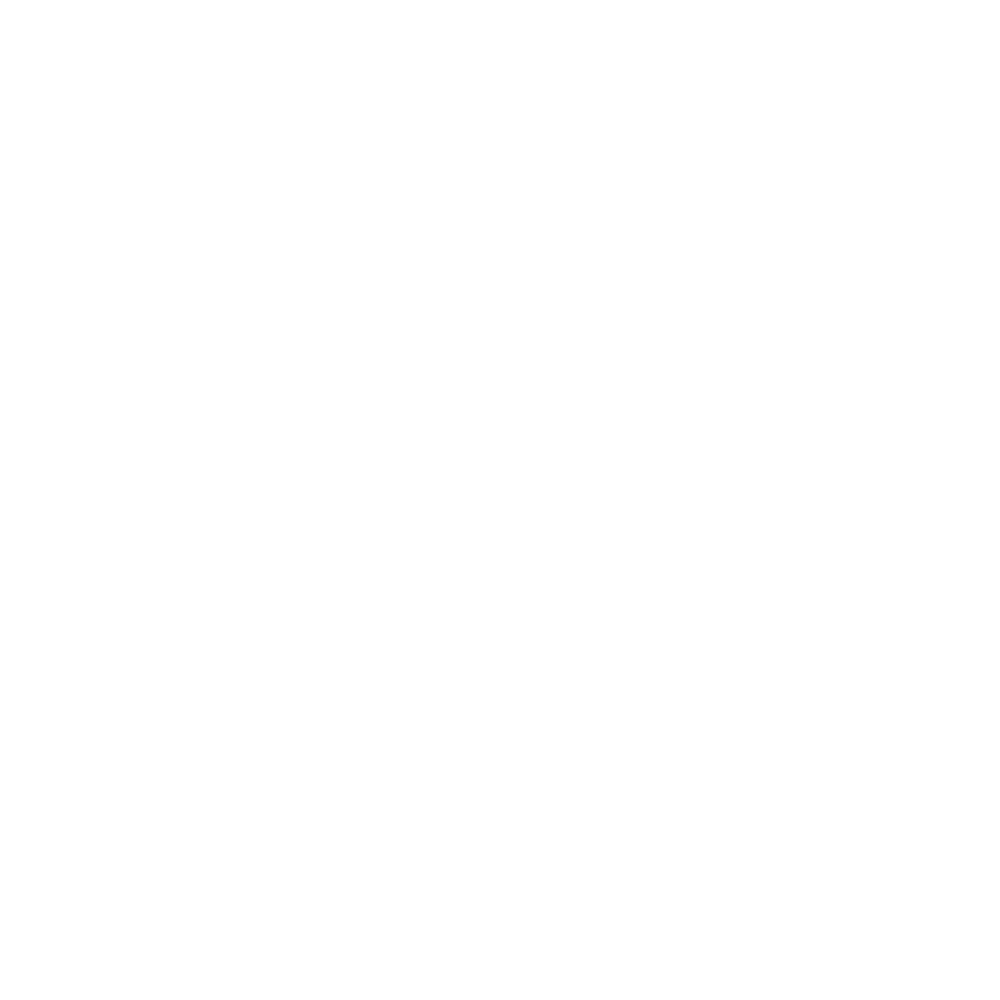
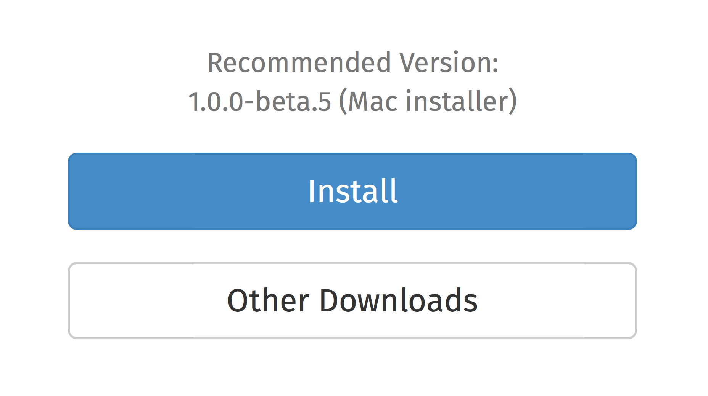

^ Hi, my name is Santiago Lapresta, I'm a software developer at Typeform, and
I'm here to talk to you about Rust. To some of you, this will be your first
introduction to the Rust programming language.

---

# [fit] What?

^ So, you may be wondering, what's Rust, and why should I care?

---

> Rust is a systems programming language that runs blazingly fast, prevents almost all crashes, and eliminates data races.

> - rust-lang.org

^ According to the webpage, Rust is a systems programming language that runs
blazingly fast, prevents almost all crashes, and eliminates data races.

---

# Systems programming language

^ So, what does it mean for it to be a "systems programming language"?

---

# Systems programming language

* Operating systems
* Compilers

^ The term "systems programming" refers to the low-level, elemental interfaces
of computer systems, such as operating systems or compilers.

---

# Blazingly fast

^ "Blazingly fast" has an obvious meaning, but it has not-so-obvious tradeoffs.

---

# Blazingly fast

* Close to the metal
* Manual memory management
* Low-level

^ By being close to the metal and providing manual memory management, it shifts
the responsability of menial memory management tasks back to the user; this
contrasts heavily with high-level languages such as Go, Python or Ruby.

---

# Prevents almost all crashes

^ One of the main points of Rust is safety. "Prevents almost all crashes" means
that...

---

# Prevents almost all crashes

* Safe memory management
* No null pointers
* No segmentation faults

^ ... memory management is validated at compile time. There are no null pointers
and most forms of memory crashes, such as dangling pointers to the stack,
are detected at compile time.

---

# Eliminates data races

^ The aforementioned safety also extends to concurrency and parallelism.

---

# Eliminates data races

* Safe parallelism
* Concurrency primitives

^ One of the motivations behind the creation of Rust was the frustration caused
by C++'s concurrency model when trying to get Firefox to parse and render websites
concurrently.

---

# [fit] Why?

^ So, why is Rust important?

---

# Memory management is hard

^ Well, the reason we've moved away from low-level languages in recent times is
that memory management is hard, tedious and error-prone.

---

# Concurrency is **really** hard

^ Similarly, the push towards concurrent computation means that these memory management issues are now spread across several, intercommunicating processing
cores.

---

# Compile-time guarantees are **awesome!**

^ Rust provides compile-time guarantees that ensure that the way your program
manages memory is correct and well-behaved on concurrent scenarios.

---

# [fit] How?

^ How does Rust achieve these goals?

---

# Ownership

^ A key point in Rust, perhaps its most innovative feature, is the notion of
ownership.

---

# Ownership

* Tracing values and references through scopes
* Automatically free memory when out of scope

^ When compiling your code, Rust's compiler verifies that memory is managed
correctly. This is, intuitively, similar to the way variable names get into and
out of scope in interpreted languages such as Ruby or Javascript. This means
that memory freeing instructions are inserted automatically by the compiler
whenever a given value goes out of scope.

---

# Immutability

^ Another key point, although a less important one, is the notion of mutability
as something to avoid.

---

# Immutability

* Mutability must be explicitly annotated

^ Rust forces you to annotate mutable variables explicitly, defaulting to
immutability. While this is not a novel concept, and it is in fact common on
most modern functional languages, it is not common on low-level languages.

---

# Code generation

^ A very interesting feature of Rust is its code generation capabilities.

---

# Code generation

* Hygienic macro system
* Compiler plugin architecture _(soon!)_

^ Rust has an hygienic macro system. Like C's preprocessor declarations, it
allows you to abstract code repetition outside the type system; unlike those,
Rust's macros are hygienic, which means the side effects of their expansion do
not propagate outside the macro. It also has a compiler plugin architecture,
which allows for complex compile-time linting and checking; however, this has
not been included on the 1.0 release and it's only available in the nightlies.

---

# [fit] Getting
# [fit] started

^ So, how do we start our first Rust project?

---

# __rust-lang.org__

^ First, we need to download Rust...

---



^ ... by clicking on the big blue button.

---

```
$ cargo new --bin hello-rust
$ cd hello-rust
```

^ After it has downloaded and installed, we can just run Cargo, Rust's project
automation and dependency manager tool, and tell it to create a new project. The
"bin" flag means that our project is a target application; if not present, Cargo
will default to creating a library.

---

```rust
$ cat src/main.rs
fn main() {
    println!("Hello, world!");
}
```

^ Rust's default empty project already includes a "hello world" snippet. This is
very convenient to us!

---

```
$ cargo run
Compiling hello-rust v0.1.0
  Running `target/debug/hello-rust`
Hello, world!
```

^ Cargo can also run and compile your application for you. Just run "cargo run"
and it will automatically download all dependencies and compile your code. Voila!

---

# [fit] More?

^ So, that's it! If you want to know more, there's a bunch of links with
resources in the next slides. I will be posting those on the Meetup mailing list,
so, don't worry!

---

# Resources

* [Cargo](http://crates.io) — project automation and package management
* [The Book](http://doc.rust-lang.org/book/) — a high-speed introduction to Rust
* [The Docs](http://doc.rust-lang.org/std/) — all the documentation you'll ever need
* [Rust by Example](http://rustbyexample.com) — sample code snippets to learn from
* [An alternative introduction to Rust](http://words.steveklabnik.com/a-new-introduction-to-rust) — understanding ownership

---

# Community

* [Reddit](http://reddit.com/r/rust) — /r/rust
* [Forum](https://users.rust-lang.org)
* [Github](https://github.com/rust-lang/rust)
